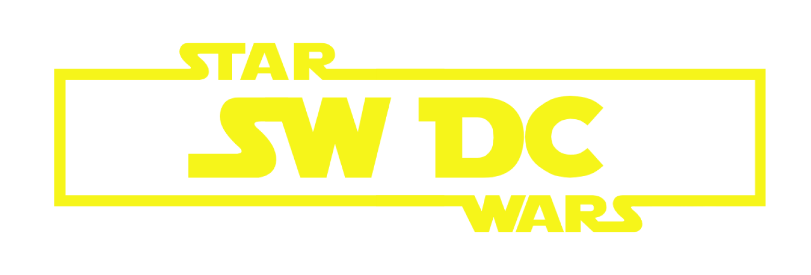

<!--
*** Thanks for checking out this README Template. If you have a suggestion that would
*** make this better, please fork the Error-Central-API and create a pull request or simply open
*** an issue with the tag "enhancement".
*** Thanks again! Now go create something AMAZING! :D
***
***
***
*** To avoid retyping too much info. Do a search and replace for the following:
*** conradoalexsander, Error-Central-API, twitter_handle, email
-->

<!-- PROJECT SHIELDS -->
<!--
*** I'm using markdown "reference style" links for readability.
*** Reference links are enclosed in brackets [ ] instead of parentheses ( ).
*** See the bottom of this document for the declaration of the reference variables
*** for contributors-url, forks-url, etc. This is an optional, concise syntax you may use.
*** https://www.markdownguide.org/basic-syntax/#reference-style-links
-->
[![Contributors][contributors-shield]][contributors-url]
[![Forks][forks-shield]][forks-url]
[![Stargazers][stars-shield]][stars-url]
[![Issues][issues-shield]][issues-url]
[![MIT License][license-shield]][license-url]
[![LinkedIn][linkedin-shield]][linkedin-url]

A fictitious star wars club page made to study Responsive pages concepts 
<!-- PROJECT LOGO -->
 

  

  <h1 align="center">Star Wars Dresden Club Responsive Page</h1>

  <h2 align="center">
    May the Code be with you!
  </h2>
     
 

<!-- ABOUT THE PROJECT -->
## <h2 id="about-the-project"> :mortar_board: &nbsp; &nbsp; About The Project </h2>
This project is a possible solution to the [Responsive Club Challenge](https://github.com/conradoalexsander) from Codeacademy, as part of the studies I did at SWO academy.

It focus on learning and exploring the Responsive pages concepts, through a web page of a regional club. 

As a good geek, I decided to make a ficticious Star Wars Club, using HTML and CSS.

<!-- BUILT WITH -->
## <h2 id="built-with">:rocket: &nbsp; &nbsp; Built With</h2> 
*  HTML5
*  CSS3 

<!-- DEMO -->
## <h2 id="demo"> :tv: &nbsp; &nbsp; Demo </h2>

You can check a demo of the live version here:
| Platform | Service | Link |
| :--- | :--- | :--- |
| Github Pages | Live version| [https://conradoalexsander.github.io/swdc-responsive-page](https://conradoalexsander.github.io/swdc-responsive-page)|

<!-- Disclaimer -->
## <h2 id="license"> :scroll: &nbsp; &nbsp; Disclaimer </h2>

<h3>I do not own any images in this projects, they are used just for context </h3>

<!-- CONTACT -->
## <h2 id="contact"> :telephone_receiver: &nbsp; &nbsp; Contact </h2>

Github: [https://github.com/conradoalexsander](https://github.com/conradoalexsander)  

<!-- MARKDOWN LINKS & IMAGES -->
<!-- https://www.markdownguide.org/basic-syntax/#reference-style-links -->
[contributors-shield]: https://img.shields.io/github/contributors/conradoalexsander/Error-Central-API.svg?style=flat-square
[contributors-url]: https://github.com/conradoalexsander/Error-Central-API/graphs/contributors

[forks-shield]:  https://img.shields.io/github/forks/conradoalexsander/Error-Central-API.svg?style=flat-square

[forks-url]: https://github.com/conradoalexsander/Error-Central-API/network/members

[stars-shield]: https://img.shields.io/github/stars/conradoalexsander/Error-Central-API.svg?style=flat-square
[stars-url]: https://github.com/conradoalexsander/Error-Central-API/stargazers
[issues-shield]: https://img.shields.io/github/issues/conradoalexsander/Error-Central-API.svg?style=flat-square
[issues-url]: https://github.com/conradoalexsander/Error-Central-API/issues
[license-shield]: https://img.shields.io/github/license/conradoalexsander/Error-Central-API.svg?style=flat-square
[license-url]: https://github.com/conradoalexsander/Error-Central-API/blob/master/LICENSE.txt
[linkedin-shield]: https://img.shields.io/badge/-LinkedIn-black.svg?style=flat-square&logo=linkedin&colorB=555
[linkedin-url]: https://www.linkedin.com/in/conrado-alexsander
[product-screenshot]: images/screenshot.png
